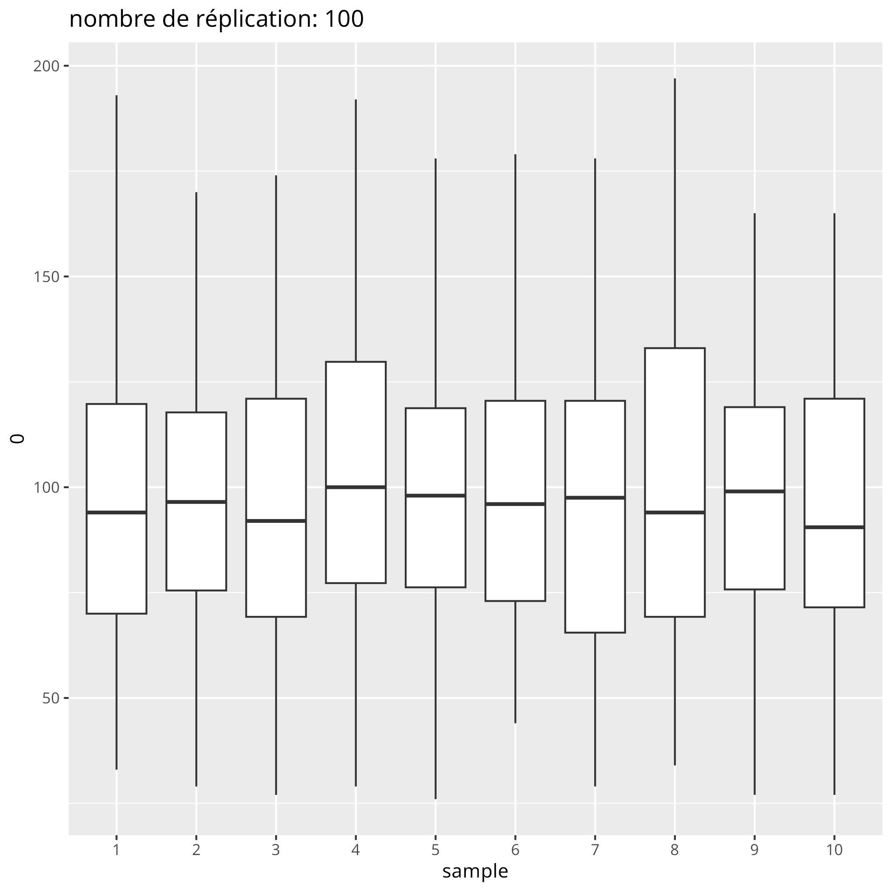
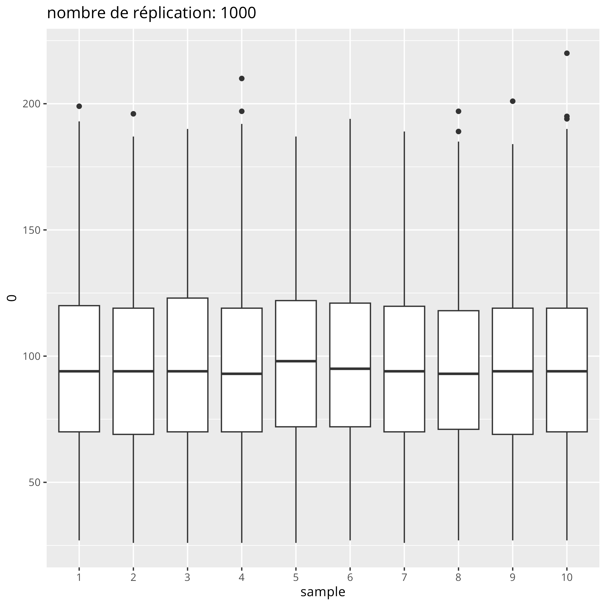
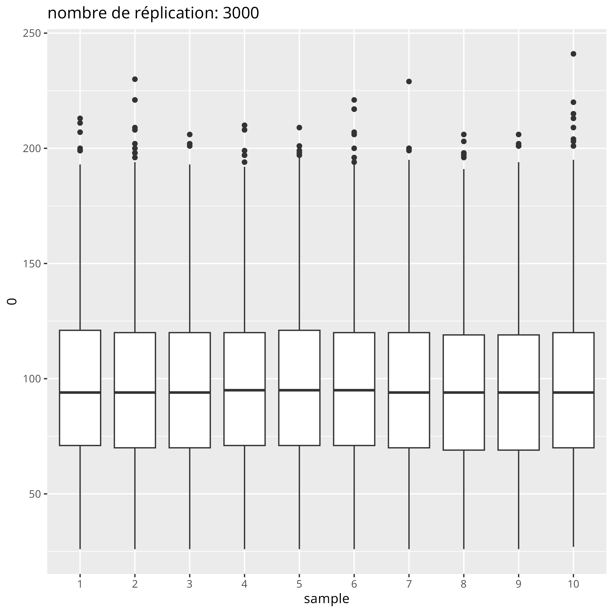

# JeuNiayes2040

Nouvelles variables de sorties du `.jar` disponible [ici](data/jeu_niayes.jar):
```r
[1]  p.capitalini,          p.parcellesini,        profnappe, p.capital,    p.prelevtot, 
[6]  p.tot_vente_parcelles, p.tot_achat_parcelles, p.profmax, p.totoignon,  p.totchou, 
[11] p.totaubergine,        p.totpiment,           p.totpdt,  p.totcarotte, p.nbparcelle_noncultivee, 
[16] p.totlance,            p.totgag,              p.totseau, p.rangpartie1,p.rangpartie2,
[21] p.rangpartie3
```
---

Fait :neckbeard: : 
- 3000 réplications  x trois régimes de pluie :white_check_mark:
- update model version du 11/02 :white_check_mark:
    - capital initial, parcelles initiales, capital final, prélèvement en eau, profondeur du puits, dynamique d'agrandissement ou de réduction foncière (affiner stratégies cultures/irrigation)
- relancer plus de simulations (3000 ) :white_check_mark:
- Renouveler le travail sur les boxplot pour avoir -> 3000 :white_check_mark:
- script function_stat---> coder la dynamique soustraire ventes et additionner les achats :white_check_mark:
- pour la stratégie du rang, privilégier la moyenne :white_check_mark:
- Boxplot : pour montrer que la répartition des pluies a assez peu d'impact :white_check_mark:

A faire :
- retrouver le calcul de la prof de la nappe par partie irl.
- Etienne : clustering profil joueurs :smoking:
- Camille : projeter joueurs, ajouter prof nappe/ action collective ou multiplication action individuelle
- Pour la figure capital-water / player : 
    - Faire apparaitre le front de Pareto
    - Caluler le "capital médian" pour positionner les joueur par rapport a ça

Pour plus tard :
- dans les simule : tester des config initiales avec des répartitions plus ou moins équitables des parcelles et capitaux de base

## Variabilité des résultats




Ces 4 figure nous montre qu'au travers l'augmentation du nombre de réplication, on arrive a stabiliser les résultats des échantillons. Nous avons décider de choisir 3000 réplication dans la suite de l'analyse
## Analyse à l'échelle des joueurs
- les joueurs sont tous au-dessus du front de Pareto
- espace inexploré en haut à droite par les joueurs
- idée pour trouver des seuils : utiliser le "capital médian" --> positionner les joueurs par rapport à lui


## Analyse à l'échelle des parties

	
