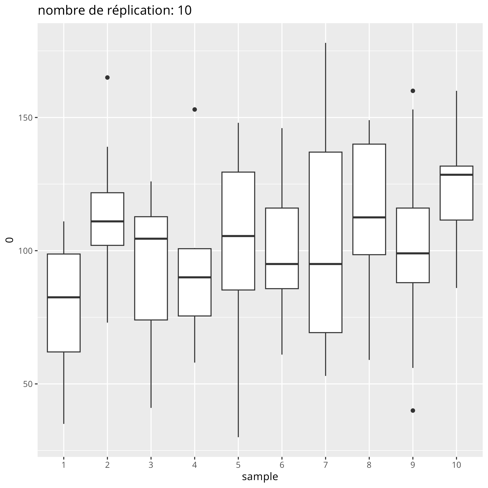

# JeuNiayes2040

Nouvelles variables de sorties :

p.capitalini,p.parcellesini,profnappe, p.capital, p.prelevtot, p.tot_vente_parcelles,p.tot_achat_parcelles,p.profmax,p.totoignon,p.totchou,p.totaubergine
,p.totpiment,p.totpdt,p.totcarotte,p.nbparcelle_noncultivee,p.totlance,p.totgag,p.totseau,p.rangpartie1,p.rangpartie2,p.rangpartie3

Fait :neckbeard: : 
- 3000 réplications  x trois régimes de pluie :white_check_mark:
- update model version du 11/02 :white_check_mark:
A faire :
- Renouveler le travail sur les boxplot pour avoir -> 3000
- retrouver le calcul de la prof de la nappe par partie irl.
- script function_stat---> coder la dynamique soustraire ventes et additionner les achats :smoking:
- Etienne : clustering profil joueurs
- Camille : projeter joueurs, ajouter prof nappe/ action collective ou multiplication action individuelle
- relancer plus de simulations (3000 )
- pour la stratégie du rang, privilégier la moyenne
- pour plus tard, dans les simule : tester des config initiales avec des répartitions plus ou moins équitables des parcelles et capitaux de base

## Variabilité des résultats

## Analyse à l'échelle des joueurs

## Analyse à l'échelle des parties

1. Pour la figure capital-water / player : 
	Faire apparaitre le front de Pareto

2. Boxplot : pour montrer que la répartition des pluies a assez peu d'impact

3. "capital_water_players_pluie_realSession":
	- les joueurs sont tous au-dessus du front de Pareto
	- espace inexploré en haut à droite par les joueurs
	- idée pour trouver des seuils : utiliser le "capital médian" --> positionner les joueurs par rapport à lui
	
	Variables à regarder :
	capital initial, parcelles initiales, capital final, prélèvement en eau, profondeur du puits, dynamique d'agrandissement ou de réduction foncière (affiner stratégies cultures/irrigation)
	
